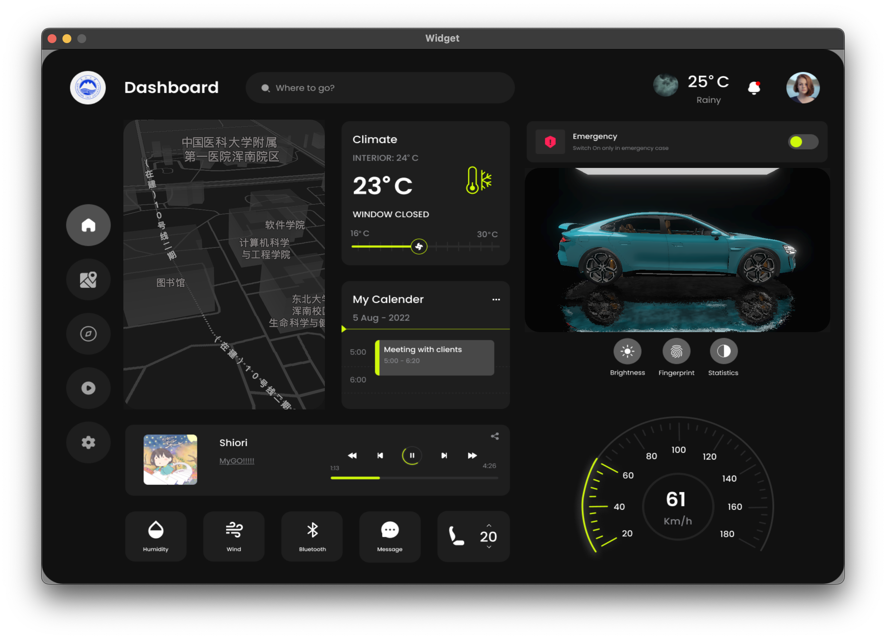

# QcDashboard

## Preview

## Credits
- QT6
- AMap
- [Pong-lei/su7_imitate](https://github.com/Pong-lei/su7_imitate)
- [Car Assistant Dashboard](https://www.figma.com/community/file/1154325384365205487/car-assistant-dashboard)
- [Weather Icon Apple](https://support.apple.com/zh-sg/guide/iphone/iph4305794fb/ios)
- [aminawinti/the-weather-forecasting](https://github.com/aminawinti/the-weather-forecasting)